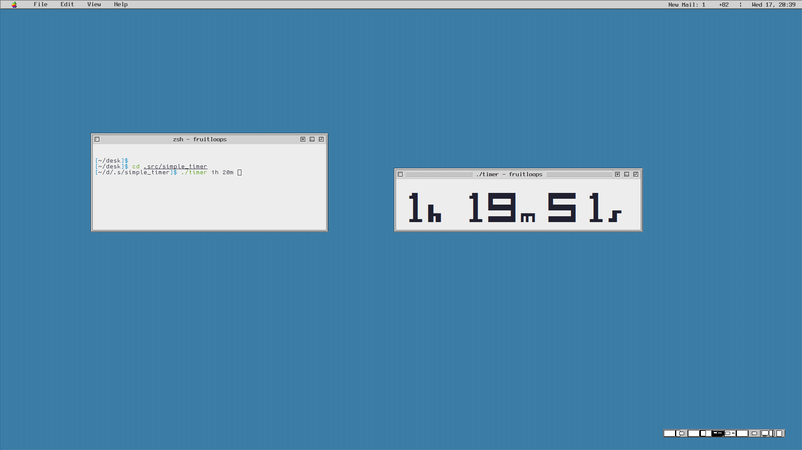

# simple_timer
A timer that counts down in human seconds

Many tools and commands like sleep do not keep track of the actual number of seconds, so if a computer goes to sleep your timer ceases to keep track. This is unfortunate if you're trying to remind yourself of a meeting, but don't want to/can't rely on a calendar.

There should be no dependencies. It is a basic C script with some cute printing. The cute printing can be disabled if you look at the code.

